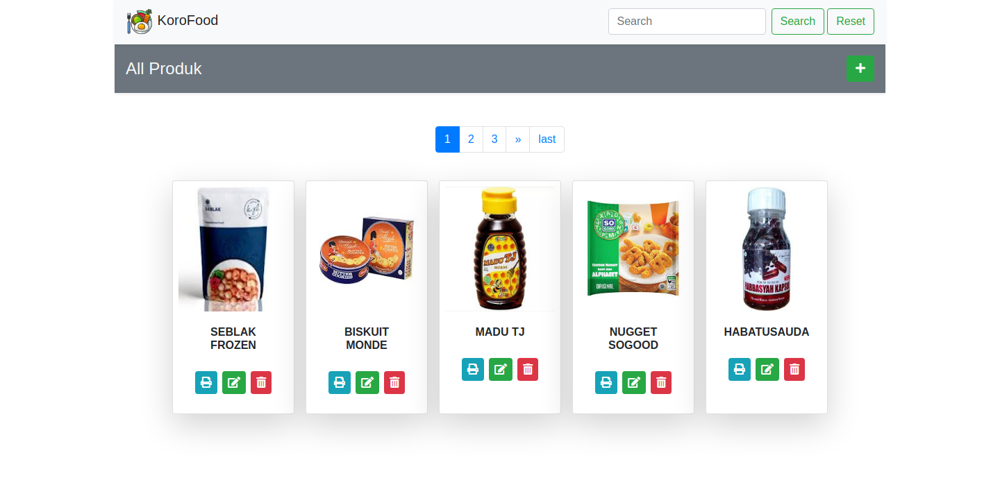
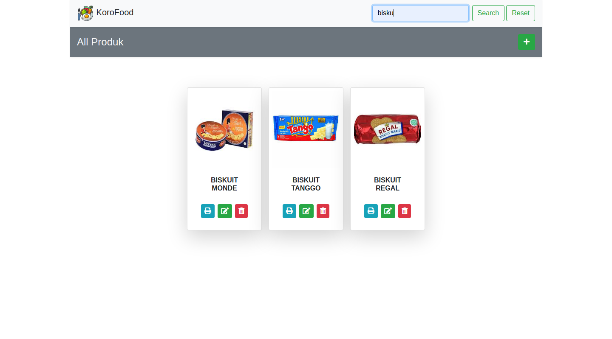
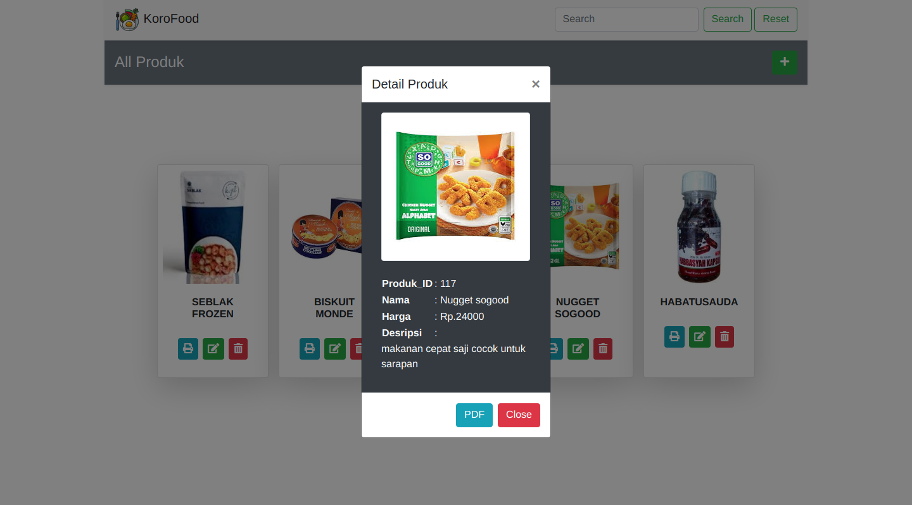
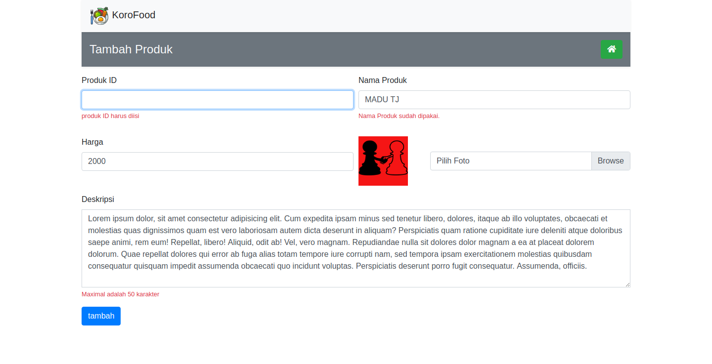

# Explore Codeigniter 3
this is a simple CRUD App that i made after watching playlist of codeigniter 3 from <a href="https://www.youtube.com/watch?v=dMRCZGGAx74&list=PLFIM0718LjIVdFn6LHoD5gJ8UjvI1Baqp">Sandhika Galih's youtube chanel</a>. 

## Tools
- [x] VS Code
- [x] PhpMyadmin
- [x] FileZilla

## Features
* Paginaton
* Search Enggine :)
* Form Validation

## Screenshoot
Live Demo Can access at <a href="http://explore-ci3.epizy.com/">http://explore-ci3.epizy.com/</a> <br><br>
<br><br>
<br><br>
<br><br>
<br><br>

## Installation

1. Go to htdocs and open the terminal there

2. Copy and paste the following command into terminal 
```
> $ git clone https://github.com/bagaselkoro3rd/readme-test.git
```

3. import db_codeigniter3.sql into phpMyadmin